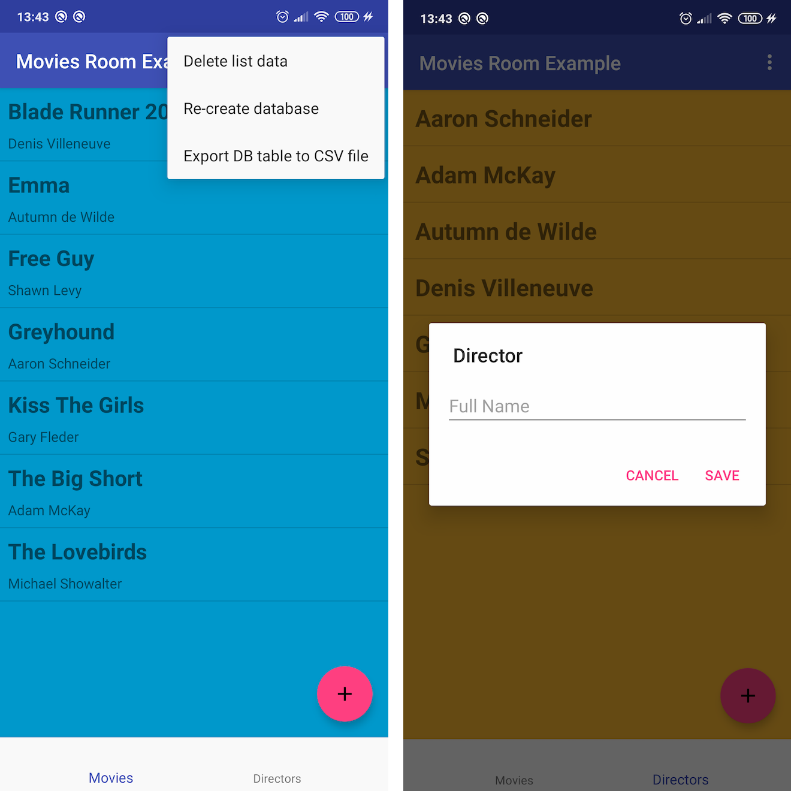

# movies-room

Example Android application with [Room DB](https://developer.android.com/topic/libraries/architecture/room.html) persistant storage and [ViewModel](https://developer.android.com/topic/libraries/architecture/viewmodel.html) with [LiveData](https://developer.android.com/topic/libraries/architecture/livedata.html) and coroutines. Additionalially, there's a menu option to export DB tables to CSV files, using [FileProvider](https://developer.android.com/reference/androidx/core/content/FileProvider) and [kotlin-csv](https://github.com/doyaaaaaken/kotlin-csv) library.

All code is in Kotlin.

I explain the code in details [here](https://medium.com/@tonia.tkachuk/android-app-example-using-room-database-63f7091e69af).

